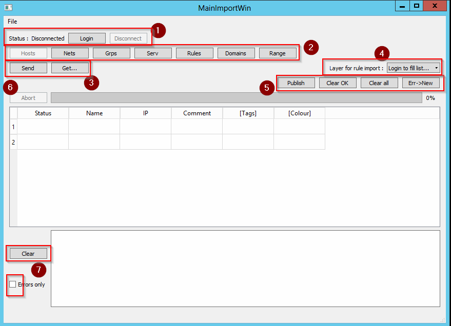

Documentation
===============

This software is all about creating certs/csr and keys quickly. 

Be careful to save you certificates and keys, as the software won't warn you about unsaved changes !

The main window has all you need : 

* Subject : all elements that will be set in your certificate / CSR. Only the CN will be set in a new CSR
* Key : type / length of key to generate. Check "password protected" to encrypt your key
* "Generate button" : see below

Main Window
---------------

* 1 : login/logout
* 2 : Object type to import (independant tables : you can switch from one to another and all data will be kept)
* 3 : Send : send data to Management
* 4 : Layer selection when importing rules. You must login for the soft to fill this.
* 5 : Publish : publish the changes on management. See below for other buttons
* 6 : Abort button : when sending large amout of data.
* 7 : Logs. All logs are displayed here. Check "Error only" to only display errors.

* Status : 
New : the object will be pushed to management when “send” is clicked.
OK : the object was sent to the management and accepted without warnings
ERR <message> : the object was sent to management who replied with a warning (object created) or error (object not created).

------------------
TODO
TO BE CONTINUED