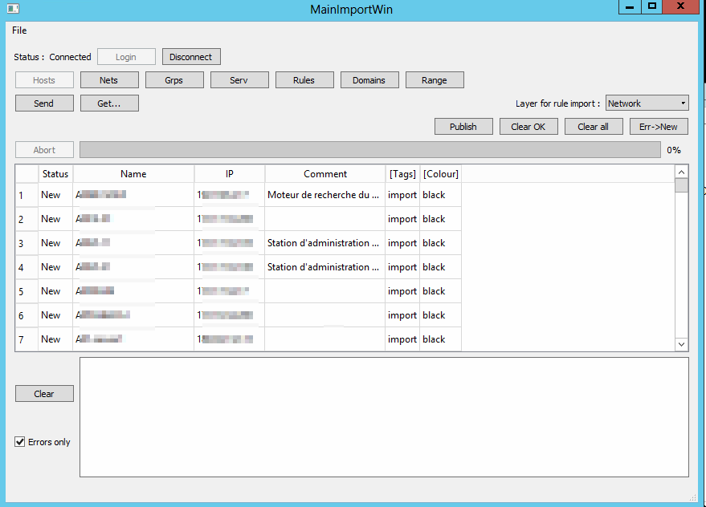
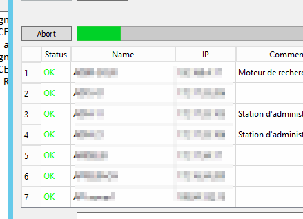
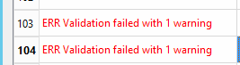
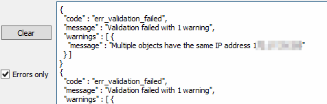
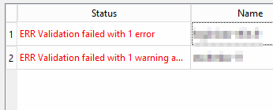
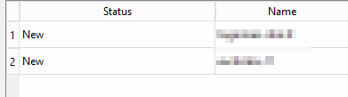

Documentation
===============

Import Host/nets/…. (all except rules)
--------------------------------------

Copy the data, then paste (ctrl-v or File->Paste)

Then click “Send”:

In case of error or warning : the object is not created and line turns to "ERR".
The push will continue on other objects.

You can see the error in the log window : 

When all objects have been tried push the “Clear Ok” Button : all the objects with OK status will be erased.

You then only have objects in "ERR" state.

Make the changes nedded in the objects or clear the line if you don't want to import them anymore.
(note : you can also enter "OK" in state and hit "Clear Ok" button)

Then push the err->new button to turn all "ERR" into "New" status

before : 

after :

Repeat until you get fed up of the migration

Don’t forget to “publish” by hitting "publish" button
-----------------------------------------------------

Next : 