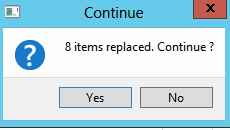

Documentation
===============

Import rules
------------

Rules follow the same principles as other imports except : 
-	It stops at first error to preserve rule order
-	When an object is not found, it asks to replace it with a valid one in ALL following rules.

Example : 

Then it asks you to “continue” : if you click “Yes” the rule will be set to “New” and tried again

Finished for now !
------------------